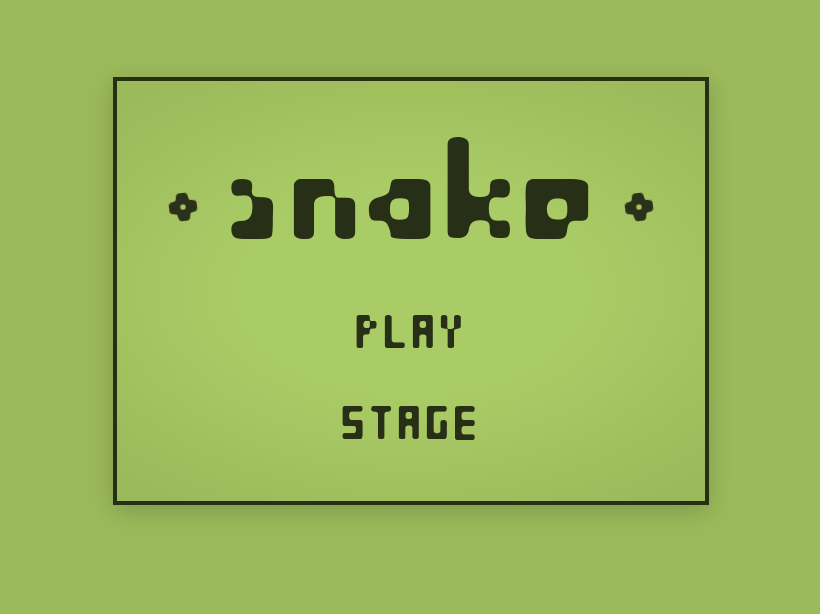

# 🐍 Snake

A browser-based Snake game built with **vanilla JavaScript** — no frameworks, no bundler, no dependencies. Just ES modules, CSS custom properties, and a `requestAnimationFrame` game loop.


<!-- Replace with an actual screenshot -->

---

## Features

- **Classic mode** — three difficulty levels (Slug / Worm / Python), edge-wrapping, infinite play
- **Stage mode** — three hand-crafted levels with wall obstacles, food targets, and per-stage speed
- **Keyboard & touch** — arrow keys, WASD, and full swipe/tap support for mobile
- **Responsive scaling** — the fixed-size board scales down to fit any screen without layout shifts
- **High score tracking** — per-difficulty high scores kept for the session
- **Stage progress** — completed stages saved to `localStorage` so progress survives page reloads

---

## Getting Started

No build step required. Serve the project root over any static file server.

### Option 1 — VS Code Live Server

Install the [Live Server](https://marketplace.visualstudio.com/items?itemName=ritwickdey.LiveServer) extension, right-click `index.html`, and select **Open with Live Server**.

### Option 2 — Python

```bash
python -m http.server 8080
```

Then open `http://localhost:8080` in your browser.

### Option 3 — Node `serve`

```bash
npx serve .
```

> **Note:** The game uses ES modules (`type="module"`), so it must be served over HTTP — opening `index.html` directly as a `file://` URL will not work.

---

## How to Play

| Action | Keyboard | Mobile |
|---|---|---|
| Steer | Arrow keys or WASD | Swipe |
| Pause / Resume | Space | Tap |
| Back to menu | Escape | — |

---

## Project Structure

```
/
├── index.html
├── styles/
│   └── style.css
├── assets/
│   ├── fonts/equilibrium.woff2
│   └── images/food.svg
├── js/
│   ├── main.js                  Entry point — wires all modules together
│   ├── game/
│   │   ├── constants.js         Enums: directions, screens, difficulties
│   │   ├── state.js             Initial state factory
│   │   ├── game.js              State store (get / set / subscribe)
│   │   ├── loop.js              Fixed time-step game loop (rAF)
│   │   └── stage-loader.js      Wall-map parser & localStorage progress
│   ├── systems/
│   │   ├── movement.js          Snake movement & direction queue
│   │   ├── collision.js         Collision detection & game-over
│   │   ├── input.js             Keyboard input handler
│   │   └── touch.js             Touch / swipe input handler
│   ├── entities/
│   │   └── food.js              Food collision & random respawn
│   └── ui/
│       ├── renderer.js          DOM renderer (menus, board, HUD, overlays)
│       └── scale-bootstrap.js   Pre-paint viewport scale
└── stages/
    ├── index.js                 Stage registry
    ├── stage-1.js               Tutorial Meadow
    ├── stage-2.js               The Corridor
    └── stage-3.js               Snake Pit
```

---

## Adding a Stage

1. Create `stages/stage-4.js`:

```js
export default {
  id:          'stage-4',
  label:       'My Stage',
  tickRate:    100,          // ms per tick — lower is faster
  wrapEdges:   false,
  foodTarget:  6,
  snakeStart:  { x: 3, y: 1 },
  walls: [
    '#####################',
    '#...................#',
    // ... 13 more rows, 21 chars wide
    '#####################',
  ],
};
```

2. Register it in `stages/index.js`:

```js
import stage4 from './stage-4.js';
export const stages = [stage1, stage2, stage3, stage4];
```

That's it — the stage select and progress system pick it up automatically.

---

## Documentation

Detailed technical documentation lives in the [`docs/`](docs/) folder:

| File | Topic |
|---|---|
| [01-overview](docs/01-overview.md) | Architecture, data flow, design decisions |
| [02-entry-point](docs/02-entry-point.md) | `index.html` load order, pre-paint scaling |
| [03-state-management](docs/03-state-management.md) | `constants.js`, `state.js`, `game.js` store API |
| [04-game-loop](docs/04-game-loop.md) | Fixed time-step accumulator, tick lifecycle |
| [05-gameplay-systems](docs/05-gameplay-systems.md) | Movement, collision, food |
| [06-input-systems](docs/06-input-systems.md) | Keyboard and touch handling |
| [07-renderer](docs/07-renderer.md) | Full rebuild vs incremental DOM updates |
| [08-stages-and-styles](docs/08-stages-and-styles.md) | Stage configs, wall maps, CSS |
| [09-bootstrap-wiring](docs/09-bootstrap-wiring.md) | `main.js`, module dependency graph |
| [10-game-flow](docs/10-game-flow.md) | End-to-end walkthrough, state transition diagram |

---

## Browser Support

Any modern browser with ES module support — Chrome, Firefox, Safari, Edge (all current versions).

---

## License

MIT
